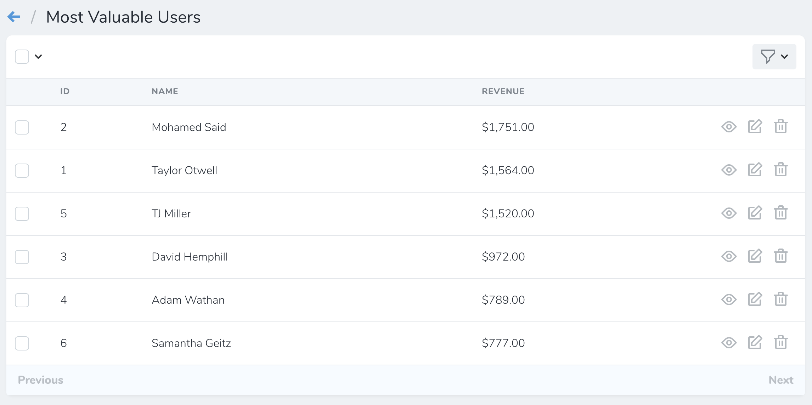

# Defining Lenses

[[toc]]

While similar to filters, Nova lenses allow you to fully customize the underlying resource Eloquent query. For example, you may want to list of all your application's users sorted by their total lifetime revenue. Creating such a list may require you to join to additional tables and perform aggregate functions within the query. If it sounds complicated, don't worry - this is exactly the type of situation lenses are designed to solve:



To get started, you may use the `nova:lens` Artisan command. By default, Nova will place newly generated lenses in the `app/Nova/Lenses` directory:

```bash
php artisan nova:lens MostValuableUsers
```

Each lens generated by Nova contains several methods. However, the two methods we are currently concerned with are the `query` and `fields` methods. The `query` method is responsible for building the Eloquent query that is needed to retrieve the desired data, while the `fields` method returns an array of fields that should be displayed when viewing the lens.

To learn more, let's take a look at a complete lens definition that displays users and their lifetime revenue:

```php
<?php

namespace App\Nova\Lenses;

use Laravel\Nova\Fields\ID;
use Illuminate\Http\Request;
use Laravel\Nova\Fields\Text;
use Laravel\Nova\Lenses\Lens;
use Laravel\Nova\Fields\Number;
use Illuminate\Support\Facades\DB;
use Laravel\Nova\Http\Requests\LensRequest;

class MostValuableUsers extends Lens
{
    /**
     * Get the query builder / paginator for the lens.
     *
     * @param  \Laravel\Nova\Http\Requests\LensRequest  $request
     * @param  \Illuminate\Database\Eloquent\Builder  $query
     * @return mixed
     */
    public static function query(LensRequest $request, $query)
    {
        return $request->withOrdering($request->withFilters(
            $query->select(self::columns())
                  ->join('licenses', 'users.id', '=', 'licenses.user_id')
                  ->orderBy('revenue', 'desc')
                  ->groupBy('users.id', 'users.name')
        ));
    }

    /**
     * Get the columns that should be selected.
     *
     * @return array
     */
    protected static function columns()
    {
        return [
            'users.id',
            'users.name',
            DB::raw('sum(licenses.price) as revenue'),
        ];
    }

    /**
     * Get the fields available to the lens.
     *
     * @param  \Illuminate\Http\Request  $request
     * @return array
     */
    public function fields(Request $request)
    {
        return [
            ID::make('ID', 'id'),
            Text::make('Name', 'name'),

            Number::make('Revenue', 'revenue', function ($value) {
                return '$'.number_format($value, 2);
            }),
        ];
    }

    /**
     * Get the cards available for the lens.
     *
     * @param  \Illuminate\Http\Request  $request
     * @return array
     */
    public function cards(Request $request)
    {
        return [];
    }

    /**
     * Get the filters available for the lens.
     *
     * @param  \Illuminate\Http\Request  $request
     * @return array
     */
    public function filters(Request $request)
    {
        return [];
    }

    /**
     * Get the actions available for the lens.
     *
     * @param  \Illuminate\Http\Request  $request
     * @return array
     */
    public function actions(Request $request)
    {
        return [];
    }

    /**
     * Get the URI key for the lens.
     *
     * @return string
     */
    public function uriKey()
    {
        return 'most-profitable-users';
    }
}
```

:::tip Columns Method

In this example, the `columns` method has been extracted from the `query` method for readability. It is not "required" and is not a "feature" of lenses.
:::

:::warning Lens Column Selection

When writing your lens query, you should always try to include the resource's ID as a selected column. If the ID is not included, Nova will not be able to display the "Select All Matching" option for the lens. In addition, the resource deletion menu will not be available.
:::

As you can see in the example above, the `query` method has full control of the Eloquent query used to retrieve the lens data. The `fields` method may leverage any of Nova's fields in order to appropriately display the data retrieved by the query.

### Lens Metrics

Each Nova lens also contains a `cards` method. This method allows you to attach any of your existing [metrics](./../metrics/defining-metrics.md) to the lens:

```php
use App\Nova\Metrics\NewUsers;

/**
 * Get the cards available for the lens.
 *
 * @param  \Illuminate\Http\Request  $request
 * @return array
 */
public function cards(Request $request)
{
    return [new NewUsers];
}
```

### Lens Filters

Each Nova lens also contains a `filters` method. This method allows you to attach any of your existing [filters](./../filters/defining-filters.md) to the lens:

```php
use App\Nova\Filters\UserType;

/**
 * Get the filters available for the lens.
 *
 * @param  \Illuminate\Http\Request  $request
 * @return array
 */
public function filters(Request $request)
{
    return [new UserType];
}
```

### Lens Actions

Each Nova lens also contains an `actions` method. This method allows you to attach any of your existing [actions](./../actions/defining-actions.md) to the lens:

```php
use App\Nova\Actions\Export;

/**
 * Get the actions available for the lens.
 *
 * @param  \Illuminate\Http\Request  $request
 * @return array
 */
public function actions(Request $request)
{
    return [new Export];
}
```

:::warning Resource Actions

By default, lens will inherit the actions of their associated resource. However, you may override the `actions` method on the lens to define a custom set of actions that should be available to the lens.
:::
