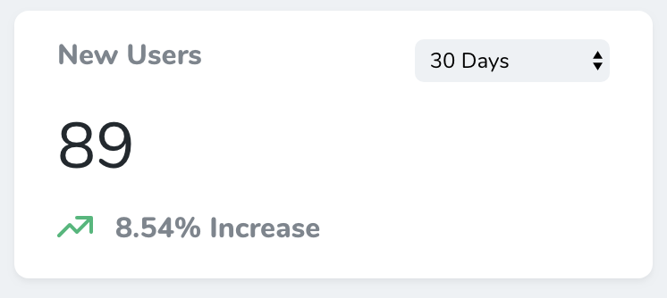
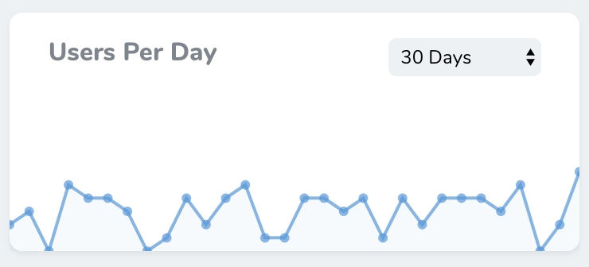
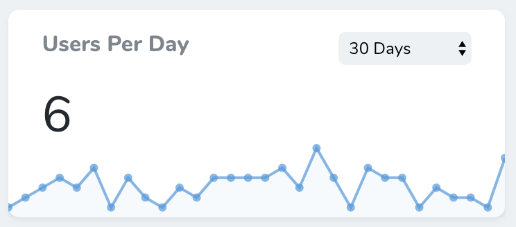
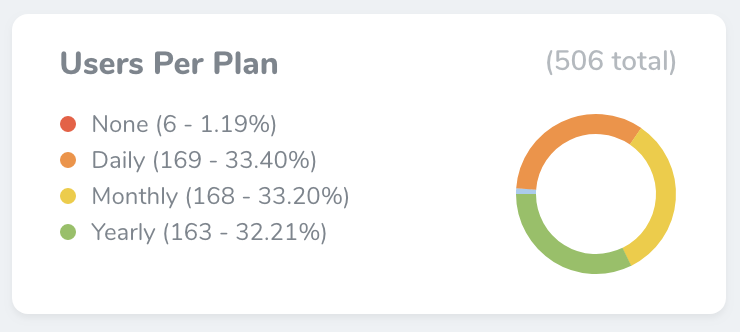

# Defining Metrics

[[toc]]

Nova metrics allow you to quickly gain insight on key business indicators for your application. For example, you may define a metric to display the total number of users added to your application per day, or the amount of weekly sales.

Nova offers three types of built-in metrics: value, trend, and partition. We'll examine each type of metric and demonstrate their usage below.

## Value Metrics

Value metrics display a single value and, if desired, its change compared to a previous time interval. For example, a value metric might display the total number of users created in the last thirty days compared with the previous thirty days:



Value metrics may be generated using the `nova:value` Artisan command. By default, all new metrics will be placed in the `app/Nova/Metrics` directory:

```bash
php artisan nova:value NewUsers
```

Once your value metric class has been generated, you're ready to customize it. Each value metric class contains a `calculate` method. This method should return a `Laravel\Nova\Metrics\ValueResult` object. Don't worry, Nova ships with a variety of helpers for quickly generating results.

In this example, we are using the `count` helper, which will automatically perform a `count` query against the specified Eloquent model for the selected range, as well as automatically retrieve the count for the "previous" range:

```php
<?php

namespace App\Nova\Metrics;

use App\User;
use Illuminate\Http\Request;
use Laravel\Nova\Metrics\Value;

class NewUsers extends Value
{
    /**
     * Calculate the value of the metric.
     *
     * @param  \Illuminate\Http\Request  $request
     * @return mixed
     */
    public function calculate(Request $request)
    {
        return $this->count($request, User::class);
    }

    /**
     * Get the ranges available for the metric.
     *
     * @return array
     */
    public function ranges()
    {
        return [
            30 => '30 Days',
            60 => '60 Days',
            365 => '365 Days',
            'MTD' => 'Month To Date',
            'QTD' => 'Quarter To Date',
            'YTD' => 'Year To Date',
        ];
    }

    /**
     * Get the URI key for the metric.
     *
     * @return string
     */
    public function uriKey()
    {
        return 'new-users';
    }
}
```

### Value Query Types

Value metrics don't just ship with a `count` helper. You may also use a variety of other aggregate functions when building your metric.

#### Average

The `average` method may be used to calculate the average of a given column compared to the previous time interval / range:

```php
return $this->average($request, Post::class, 'word_count');
```

#### Sum

The `sum` method may be used to calculate the sum of a given column compared to the previous time interval / range:

```php
return $this->sum($request, Order::class, 'price');
```

#### Max

The `max` method may be used to calculate the maximum of a given column compared to the previous time interval / range:

```php
return $this->max($request, Order::class, 'total');
```

#### Min

The `min` method may be used to calculate the minimum of a given column compared to the previous time interval / range:

```php
return $this->min($request, Order::class, 'total');
```

### Value Result Formatting

You can add a prefix and/or suffix to the Value metric's result by calling the `prefix` and `suffix` methods when returning the `ValueResult`:

```php
public function calculate(Request $request)
{
    return $this->count($request, User::class)
                ->prefix('$')
                ->suffix('per unit');
}
````

You may also use the `currency` method to specify the prefix for the result. By default the currency symbol will be `$`, but you may also pass in your own symbol:

```php
public function calculate(Request $request)
{
    return $this->count($request, User::class)
                ->currency('£');
}
````

To customize the display format, you can use the `format` method. The format must be a format supported by [Numeral.js](http://numeraljs.com/#format):

```php
public function calculate(Request $request)
{
    return $this->count($request, User::class)
                ->format('0,0');
}
```


### Value Ranges

Every value metric class contains a `ranges` method. This method determines the ranges that will be available in the value metric's range selection menu. The array's keys determine the number of days that should be included in the query, while the values determine the "human readable" text that will be placed in the range selection menu. You are not required to define any ranges at all:

```php
/**
 * Get the ranges available for the metric.
 *
 * @return array
 */
public function ranges()
{
    return [
        5 => '5 Days',
        10 => '10 Days',
        15 => '15 Days',
        'MTD' => 'Month To Date',
        'QTD' => 'Quarter To Date',
        'YTD' => 'Year To Date',
    ];
}
```

:::danger MTD / QTD / YTD Range Keys

You may customize these ranges to suit your needs; however, if you are using the built-in "Month To Date", "Quarter To Date", or "Year To Date" ranges, you should not change their keys.
:::

### Manually Building Value Results

If you are not able to use the included query helpers for building your value metric, you may manually provide the final values to the metric using the `result` and `previous` methods:

```php
return $this->result(100)->previous(50);
```

## Trend Metrics

Trend metrics display values over time via a line chart. For example, a trend metric might display the number of new users created per day over the previous thirty days:



Trend metrics may be generated using the `nova:trend` Artisan command. By default, all new metrics will be placed in the `app/Nova/Metrics` directory:

```bash
php artisan nova:trend UsersPerDay
```

Once your trend metric class has been generated, you're ready to customize it. Each trend metric class contains a `calculate` method. This method should return a `Laravel\Nova\Metrics\TrendResult` object. Don't worry, Nova ships with a variety of helpers for quickly generating results.

In this example, we are using the `countByDays` helper, which will automatically perform a `count` query against the specified Eloquent model for the selected range and for the selected interval unit (in this case, days):

```php
<?php

namespace App\Nova\Metrics;

use App\User;
use Illuminate\Http\Request;
use Laravel\Nova\Metrics\Trend;

class UsersPerDay extends Trend
{
    /**
     * Calculate the value of the metric.
     *
     * @param  \Illuminate\Http\Request  $request
     * @return mixed
     */
    public function calculate(Request $request)
    {
        return $this->countByDays($request, User::class);
    }

    /**
     * Get the ranges available for the metric.
     *
     * @return array
     */
    public function ranges()
    {
        return [
            30 => '30 Days',
            60 => '60 Days',
            90 => '90 Days',
        ];
    }

    /**
     * Get the URI key for the metric.
     *
     * @return string
     */
    public function uriKey()
    {
        return 'users-per-day';
    }
}
```

### Trend Query Types

Trend metrics don't just ship with a `countByDays` helper. You may also use a variety of other aggregate functions and time intervals when building your metric.

#### Count

The `count` methods may be used to calculate the count of a given column over time:

```php
return $this->countByMonths($request, User::class);
return $this->countByWeeks($request, User::class);
return $this->countByDays($request, User::class);
return $this->countByHours($request, User::class);
return $this->countByMinutes($request, User::class);
```

#### Average

The `average` methods may be used to calculate the average of a given column over time:

```php
return $this->averageByMonths($request, Post::class, 'word_count');
return $this->averageByWeeks($request, Post::class, 'word_count');
return $this->averageByDays($request, Post::class, 'word_count');
return $this->averageByHours($request, Post::class, 'word_count');
return $this->averageByMinutes($request, Post::class, 'word_count');
```

#### Sum

The `sum` methods may be used to calculate the sum of a given column over time:

```php
return $this->sumByMonths($request, Order::class, 'price');
return $this->sumByWeeks($request, Order::class, 'price');
return $this->sumByDays($request, Order::class, 'price');
return $this->sumByHours($request, Order::class, 'price');
return $this->sumByMinutes($request, Order::class, 'price');
```

#### Max

The `max` methods may be used to calculate the maximum of a given column over time:

```php
return $this->maxByMonths($request, Order::class, 'total');
return $this->maxByWeeks($request, Order::class, 'total');
return $this->maxByDays($request, Order::class, 'total');
return $this->maxByHours($request, Order::class, 'total');
return $this->maxByMinutes($request, Order::class, 'total');
```

#### Min

The `min` methods may be used to calculate the minimum of a given column over time:

```php
return $this->minByMonths($request, Order::class, 'total');
return $this->minByWeeks($request, Order::class, 'total');
return $this->minByDays($request, Order::class, 'total');
return $this->minByHours($request, Order::class, 'total');
return $this->minByMinutes($request, Order::class, 'total');
```

### Trend Ranges

Every trend metric class contains a `ranges` method. This method determines the ranges that will be available in the trend metric's range selection menu. The array's keys determine the number of time interval units (months, weeks, days, etc.) that should be included in the query, while the values determine the "human readable" text that will be placed in the range selection menu. You are not required to define any ranges at all:

```php
/**
 * Get the ranges available for the metric.
 *
 * @return array
 */
public function ranges()
{
    return [
        5 => '5 Days',
        10 => '10 Days',
        15 => '15 Days',
    ];
}
```

### Formatting The Trend Value

Sometimes you may wish to add a prefix or suffix to the trend values. To accomplish this, you may use the `prefix` and `suffix` methods:

```php
return $this->countByDays($request, User::class)
            ->prefix('$');
```

If your trend metric is displaying a monetary value, you may use the `dollars` and `euros` short-cut methods for quickly prefixing a dollar or euro sign to the trend values:

```php
return $this->countByDays($request, User::class)
            ->dollars();
```

### Displaying The Current Value

Sometimes, you may wish to emphasize the value for the latest time interval. For example, in this screenshot, six users have been created during the last day:



To accomplish this, you may use the `showLatestValue` method:

```php
return $this->countByDays($request, User::class)
            ->showLatestValue();
```

You may customize the display format using the `format` method. The format must be a format supported by [Numeral.js](http://numeraljs.com/#format):

```php
return $this->countByDays($request, User::class)
            ->showLatestValue()
            ->format('0,0');
```


### Manually Building Trend Results

If you are not able to use the included query helpers for building your trend metric, you may manually construct the `Laravel\Nova\Metrics\TrendResult` object and return it from your metric's `calculate` method:

```php
return (new TrendResult)->trend([
    'July 1' => 100,
    'July 2' => 150,
    'July 3' => 200,
]);
```

## Partition Metrics

Partition metrics displays a pie chart of values. For example, a partition metric might display the total number of users for each billing plan offered by your application:



Partition metrics may be generated using the `nova:partition` Artisan command. By default, all new metrics will be placed in the `app/Nova/Metrics` directory:

```bash
php artisan nova:partition UsersPerPlan
```

Once your partition metric class has been generated, you're ready to customize it. Each partition metric class contains a `calculate` method. This method should return a `Laravel\Nova\Metrics\PartitionResult` object. Don't worry, Nova ships with a variety of helpers for quickly generating results.

In this example, we are using the `count` helper, which will automatically perform a `count` query against the specified Eloquent model and retrieve the number of models belonging to each distinct value of your specified "group by" column:

```php
<?php

namespace App\Nova\Metrics;

use App\User;
use Illuminate\Http\Request;
use Laravel\Nova\Metrics\Partition;

class UsersPerPlan extends Partition
{
    /**
     * Calculate the value of the metric.
     *
     * @param  \Illuminate\Http\Request  $request
     * @return mixed
     */
    public function calculate(Request $request)
    {
        return $this->count($request, User::class, 'stripe_plan');
    }

    /**
     * Get the URI key for the metric.
     *
     * @return string
     */
    public function uriKey()
    {
        return 'users-by-plan';
    }
}
```


### Partition Query Types

Partition metrics don't just ship with a `count` helper. You may also use a variety of other aggregate functions when building your metric.

#### Average

The `average` method may be used to calculate the average of a given column within distinct groups. For example, the following call to the `average` method will display a pie chart with the average order price for each department of the company:

```php
return $this->average($request, Order::class, 'price', 'department');
```

#### Sum

The `sum` method may be used to calculate the sum of a given column within distinct groups. For example, the following call to the `sum` method will display a pie chart with the sum of all order prices for each department of the company:

```php
return $this->sum($request, Order::class, 'price', 'department');
```

#### Max

The `max` method may be used to calculate the max of a given column within distinct groups. For example, the following call to the `max` method will display a pie chart with the maximum order price for each department of the company:

```php
return $this->max($request, Order::class, 'price', 'department');
```

#### Min

The `min` method may be used to calculate the min of a given column within distinct groups. For example, the following call to the `min` method will display a pie chart with the minimum order price for each department of the company:

```php
return $this->min($request, Order::class, 'price', 'department');
```

### Customizing Partition Labels

Often, the column values that divide your partition metrics into groups will be simple keys, and not something that is "human friendly". Or, if you are displaying a partition metric grouped by a column that is a boolean, Nova will display your group labels as "0" and "1". For this reason, Nova allows you to provide a Closure that formats the label into something more readable:

```php
/**
 * Calculate the value of the metric.
 *
 * @param  \Illuminate\Http\Request  $request
 * @return mixed
 */
public function calculate(Request $request)
{
    return $this->count($request, User::class, 'stripe_plan')
            ->label(function ($value) {
                switch ($value) {
                    case null:
                        return 'None';
                    default:
                        return ucfirst($value);
                }
            });
}
```

### Customizing Partition Colors

By default, Nova will choose the colors used in a partition metric. Sometimes, you may wish to change these to match the type of data they represent. To do this you can call the `colors` method when returning your value from the metric:

```php
/**
 * Calculate the value of the metric.
 *
 * @param  \Illuminate\Http\Request  $request
 * @return mixed
 */
public function calculate(Request $request)
{
    // This metric has `audio`, `video`, and `photo` types
    return $this->count($request, Post::class, 'type')->colors([
        'audio' => '#6ab04c',
        'video' => 'rgb(72,52,212)',
        // photo will use the default color from Nova
    ]);
}
```

### Manually Building Partition Results

If you are not able to use the included query helpers for building your partition metric, you may manually provide the final values to the metric using the `result` method:

```php
return $this->result([
    'Group 1' => 100,
    'Group 2' => 200,
    'Group 3' => 300,
]);
```

## Caching

Occasionally the calculation of a metric's values can be slow and expensive. For this reason, all Nova metrics contain a `cacheFor` method which allows you to specify the duration the metric result should be cached:

```php
/**
 * Determine for how many minutes the metric should be cached.
 *
 * @return  \DateTimeInterface|\DateInterval|float|int
 */
public function cacheFor()
{
    return now()->addMinutes(5);
}
```
