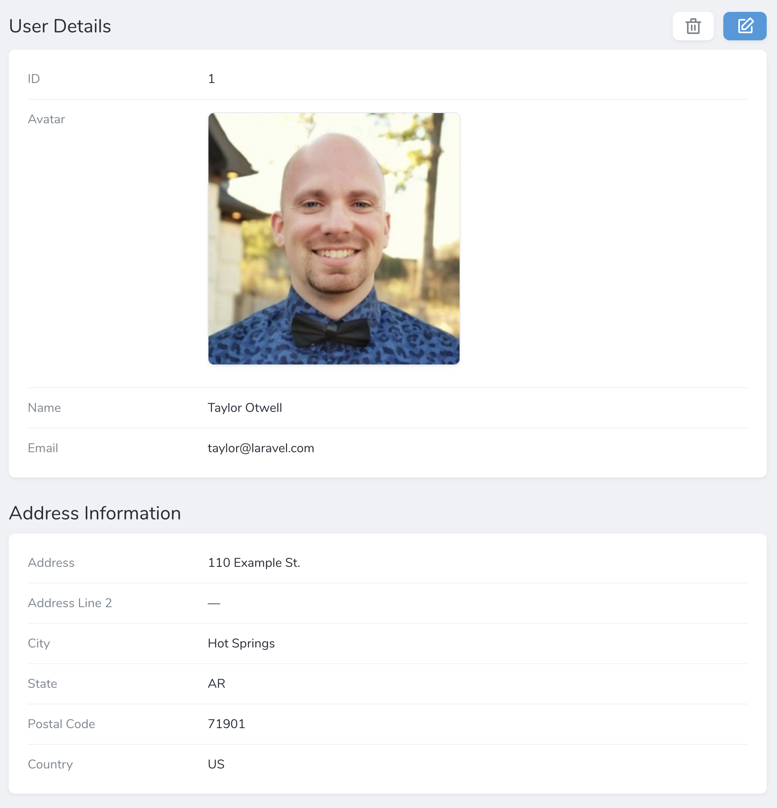
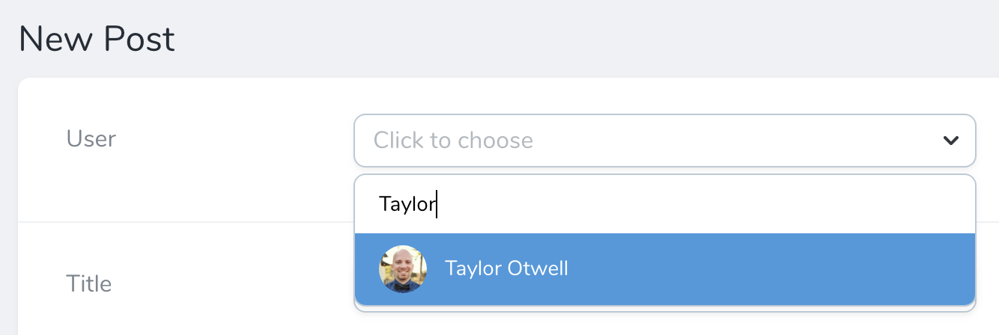
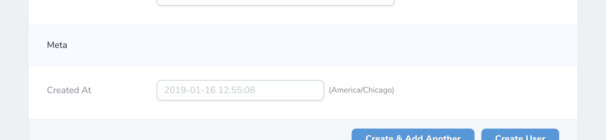
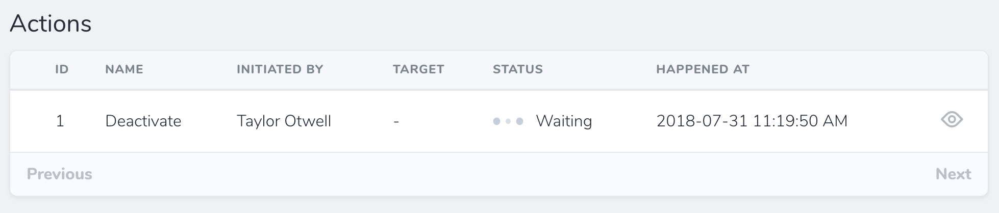

# Fields

[[toc]]

## Defining Fields

Each Nova resource contains a `fields` method. This method returns an array of fields, which generally extend the `Laravel\Nova\Fields\Field` class. Nova ships with a variety of fields out of the box, including fields for text inputs, booleans, dates, file uploads, Markdown, and more.

To add a field to a resource, we can simply add it to the resource's `fields` method. Typically, fields may be created using their static `make` method. This method accepts several arguments; however, you usually only need to pass the "human readable" name of the field. Nova will automatically "snake case" this string to determine the underlying database column:

```php
use Laravel\Nova\Fields\ID;
use Laravel\Nova\Fields\Text;

/**
 * Get the fields displayed by the resource.
 *
 * @param  \Illuminate\Http\Request  $request
 * @return array
 */
public function fields(Request $request)
{
    return [
        ID::make()->sortable(),
        Text::make('Name')->sortable(),
    ];
}
```

### Field Column Conventions

As noted above, Nova will "snake case" the displayable name of the field to determine the underlying database column. However, if necessary, you may pass the column name as the second argument to the field's `make` method:

```php
Text::make('Name', 'name_column')
```

## Showing / Hiding Fields

Often, you will only want to display a field in certain situations. For example, there is typically no need to show a `Password` field on a resource index listing. Likewise, you may wish to only display a `Created At` field on the creation / update forms. Nova makes it a breeze to hide / show fields on certain screens.

The following methods may be used to show / hide fields based on the display context:

- `hideFromIndex`
- `hideFromDetail`
- `hideWhenCreating`
- `hideWhenUpdating`
- `onlyOnIndex`
- `onlyOnDetail`
- `onlyOnForms`
- `exceptOnForms`

You may chain any of these methods onto your field's definition in order to instruct Nova where the field should be displayed:

```php
Text::make('Name')->hideFromIndex()
```

## Field Panels

If your resource contains many fields, your resource "detail" screen can become crowded. For that reason, you may choose to break up groups of fields into their own "panels":



You may do this by creating a new `Panel` instance within the `fields` method of a resource. Each panel requires a name and an array of fields that belong to that panel:

```php
use Laravel\Nova\Panel;

/**
 * Get the fields displayed by the resource.
 *
 * @param  \Illuminate\Http\Request  $request
 * @return array
 */
public function fields(Request $request)
{
    return [
        ID::make()->sortable(),

        new Panel('Address Information', $this->addressFields()),
    ];
}

/**
 * Get the address fields for the resource.
 *
 * @return array
 */
protected function addressFields()
{
    return [
        Place::make('Address', 'address_line_1')->hideFromIndex(),
        Text::make('Address Line 2')->hideFromIndex(),
        Text::make('City')->hideFromIndex(),
        Text::make('State')->hideFromIndex(),
        Text::make('Postal Code')->hideFromIndex(),
        Country::make('Country')->hideFromIndex(),
    ];
}
```

## Sortable Fields

When attaching a field to a resource, you may use the `sortable` method to indicate that the resource index may be sorted by the given field:

```php
Text::make('Name', 'name_column')->sortable()
```

## Field Types

:::tip Relationship Fields

This portion of the documentation only discusses non-relationship fields. To learn more about relationship fields, [check out their documentation](/1.0/resources/relationships.html).
:::

Nova ships with a variety of field types. So, let's explore all of the available types and their options:

- [Avatar](#avatar-field)
- [Boolean](#boolean-field)
- [Code](#code-field)
- [Country](#country-field)
- [Currency](#currency-field)
- [Date](#date-field)
- [DateTime](#datetime-field)
- [File](#file-field)
- [Gravatar](#gravatar-field)
- [Heading](#heading-field)
- [ID](#id-field)
- [Image](#image-field)
- [Markdown](#markdown-field)
- [Number](#number-field)
- [Password](#password-field)
- [Place](#place-field)
- [Select](#select-field)
- [Status](#status-field)
- [Text](#text-field)
- [Textarea](#textarea-field)
- [Timezone](#timezone-field)
- [Trix](#trix-field)

### Avatar Field

The `Avatar` field extends the [Image field](#image-field) and accepts the same options and configuration:

```php
use Laravel\Nova\Fields\Avatar;

Avatar::make('Avatar')
```

If a resource contains an `Avatar` field, that field will be displayed next to the resource's title when the resource is displayed in search results:



### Boolean Field

The `Boolean` field may be used to represent a boolean / "tiny integer" column in your database. For example, assuming your database has a boolean column named `active`, you may attach a `Boolean` field to your resource like so:

```php
use Laravel\Nova\Fields\Boolean;

Boolean::make('Active')
```

#### Customizing True / False Values

If you are using values other than `true`, `false`, `1`, or `0` to represent "true" and "false", you may instruct Nova to use the custom values recognized by your application. To accomplish this, chain the `trueValue` and `falseValue` methods onto your field's definition:

```php
Boolean::make('Active')
        ->trueValue('On')
        ->falseValue('Off');
```

### Code Field

The `Code` fields provides a beautiful code editor within your Nova administration panel. Generally, code fields should be attached to `TEXT` database columns. However, you may also attach them to `JSON` database columns:

```php
use Laravel\Nova\Fields\Code;

Code::make('Snippet')
```

:::tip Code Fields On The Index

By default, Nova will never display a `Code` field on a resource index listing.
:::

#### Editing JSON

If you intend to use a given `Code` field instance to only edit JSON, you may chain the `json` method onto your field definition:

```php
Code::make('Options')->json()
```

#### Syntax Highlighting

You may customize the language syntax highlighting of the `Code` field using the `language` method:

```php
Code::make('Snippet')->language('php')
```

The `Code` field's currently supported languages are:

- `dockerfile`
- `javascript`
- `markdown`
- `nginx`
- `php`
- `ruby`
- `sass`
- `shell`
- `vue`
- `xml`
- `yaml`

### Country Field

The `Country` field generates a `Select` field containing a list of the world's countries. The field will store the country's two-letter code:

```php
use Laravel\Nova\Fields\Country;

Country::make('Country', 'country_code')
```

### Currency Field

The `Currency` field generates a `Number` field that is automatically displayed using PHP's `money_format` function. You may specify the display format using the `format` method; otherwise, the `%i` format will be used:

```php
use Laravel\Nova\Fields\Currency;

Currency::make('Price')

Currency::make('Price')->format('%.2n');
```

### Date Field

The `Date` field may be used to store a date value (without time). For more information about dates and timezones within Nova, check out the additional [date / timezone documentation](./date-fields.md):

```php
use Laravel\Nova\Fields\Date;

Date::make('Birthday')
```

#### Date Formats

You may customize the display format of your `Date` fields using the `format` method. The format must be a format supported by [Moment.js](https://momentjs.com/docs/#/parsing/string-format/):

```php
Date::make('Birthday')->format('DD MMM'),
```

### DateTime Field

The `DateTime` field may be used to store a date-time value. For more information about dates and timezones within Nova, check out the additional [date / timezone documentation](./date-fields.md):

```php
use Laravel\Nova\Fields\DateTime;

DateTime::make('Updated At')->hideFromIndex()
```

You may customize the display format of your `DateTime` fields using the `format` method. The format must be a format supported by [Moment.js](https://momentjs.com/docs/#/parsing/string-format/):

```php
Date::make('Created At')->format('DD MMM YYYY'),
```

### File Field

To learn more about defining file fields and handling uploads, check out the additional [file field documentation](./file-fields.md).

```php
use Laravel\Nova\Fields\File;

File::make('Attachment')
```

### Gravatar Field

The `Gravatar` field does not correspond to any column in your application's database. Instead, it will display the "Gravatar" image of the model it is associated with.

By default, the Gravatar URL will be generated based on the value of the model's `email` column. However, if your user's email addresses are not stored in the `email` column, you may pass a custom column name to the field's `make` method:

```php
use Laravel\Nova\Fields\Gravatar;

// Using the "email" column...
Gravatar::make()

// Using the "email_address" column...
Gravatar::make('Avatar', 'email_address')
```

### Heading Field

The `Heading` field does not correspond to any column in your application's database. It is used to display a banner across your forms and can function as a separator for long lists of fields:



```php
Heading::make('Meta')
```

If you need to render HTML content within the `Heading` field, use the `asHtml` method:

```php
Heading::make('<p class="text-danger">* All fields are required.</p>')->asHtml()
```

::: tip Headings And Indexes

`Heading` fields are automatically hidden from the resource index screen.
:::

### ID Field

The `ID` field represents the primary key of your resource's database table. Typically, each Nova resource you define should contain an `ID` field. By default, the `ID` field assumes the underlying database column is named `id`:

```php
use Laravel\Nova\Fields\ID;

// Using the "id" column...
ID::make()

// Using the "id_column" column...
ID::make('ID', 'id_column')

// Resolve BIGINT ID fields
ID::make()->asBigInt()
```

### Image Field

The `Image` field extends the [File field](#file-field) and accepts the same options and configurations. The `Image` field, unlike the `File` field, will display a thumbnail preview of the underlying image when viewing the resource:

```php
use Laravel\Nova\Fields\Image;

Image::make('Photo')
```

By default, the `Image` field allows the user to download the linked file. To disable this you can use the `disableDownload` method on the field definition:

```php
Image::make('Photo')->disableDownload();
```

:::tip File Fields

To learn more about defining file fields and handling uploads, check out the additional [file field documentation](./file-fields.md).
:::

### Markdown Field

The `Markdown` field provides a WYSIWYG Markdown editor for its associated field. Typically, this field will correspond to a `TEXT` column in your database. The `Markdown` field will store the raw Markdown text within the associated database column:

```php
use Laravel\Nova\Fields\Markdown;

Markdown::make('Biography')
```

By default, Markdown fields will not display their content when viewing a resource on its detail page. It will be hidden behind a "Show Content" link, that when clicked will reveal the content. You may specify the Markdown field should always display its content by calling the `alwaysShow` method on the field itself:

```php
Markdown::make('Biography')->alwaysShow();
```

### Number Field

The `Number` field provides an `input` control with a `type` attribute of `number`:

```php
use Laravel\Nova\Fields\Number;

Number::make('price')
```

You may use the `min`, `max`, and `step` methods to set their corresponding attributes on the generated `input` control:

```php
Number::make('price')->min(1)->max(1000)->step(0.01)
```

### Password Field

The `Password` field provides an `input` control with a `type` attribute of `password`:

```php
use Laravel\Nova\Fields\Password;

Password::make('Password')
```

The `Password` field will automatically preserve the password that is currently stored in the database if the incoming password field is empty. Therefore, a typical password field definition might look like the following:

```php
Password::make('Password')
    ->onlyOnForms()
    ->creationRules('required', 'string', 'min:6')
    ->updateRules('nullable', 'string', 'min:6'),
```

### Password Confirmation Field

The `PasswordConfirmation` field provides an input that can be used for confirming another `Password` field. This field will only be shown on forms:

```php
PasswordConfirmation::make('Password Confirmation'),
```

### Place Field

The `Place` field leverages the power of the [Algolia Places API](https://community.algolia.com/places/) to provide ultra-fast address searching and auto-completion. An Algolia account is **not required** in order to leverage this field.

Typically, a `Place` field will be defined alongside other related address fields. In this example, in order to keep our resource tidy, we will use the `merge` method to extract the address field definitions into their own method:

```php
use Laravel\Nova\Fields\Place;

/**
 * Get the fields displayed by the resource.
 *
 * @param  \Illuminate\Http\Request  $request
 * @return array
 */
public function fields(Request $request)
{
    return [
        ID::make()->sortable(),
        $this->addressFields(),
    ];
}

/**
 * Get the address fields for the resource.
 *
 * @return \Illuminate\Http\Resources\MergeValue
 */
protected function addressFields()
{
    return $this->merge([
        Place::make('Address', 'address_line_1')->hideFromIndex(),
        Text::make('Address Line 2')->hideFromIndex(),
        Text::make('City')->hideFromIndex(),
        Text::make('State')->hideFromIndex(),
        Text::make('Postal Code')->hideFromIndex(),
        Country::make('Country')->hideFromIndex(),
        Text::make('Latitude')->hideFromIndex(),
        Text::make('Longitude')->hideFromIndex(),
    ]);
}
```

#### Searchable Countries

By default, the `Place` field will search all addresses around the world. If you would like to limit the countries included in the search, you may use the `countries` method:

```php
Place::make('Address', 'address_line_1')->countries(['US', 'CA'])
```

#### City Search

If you intend to use the `Place` field to search for cities instead of addresses, you may use the `onlyCities` method to instruct the field to only list cities in its results:

```php
Place::make('City')->onlyCities()
```

:::tip City Auto-Completion

When using the `Place` field as a city search, the `state` and `country` fields will still receive auto-completion. However, the `postal_code` field will not.
:::

#### Configuring Field Auto-Completion

By default, the place field will auto-complete the associated address fields based on their field names. The `Place` field will automatically fill fields named `address_line_2`, `city`, `state`, `postal_code`, `country`, `latitude` and `longitude`. However, you may customize the field names that should be auto-completed using the following methods:

- `secondAddressLine($column)`
- `city($column)`
- `state($column)`
- `postalCode($column)`
- `country($column)`

For example:

```php
Place::make('Address', 'address_line_1')
    ->secondAddressLine('address_2')
    ->city('city_name')
    ->state('state_code')
    ->postalCode('zip_code')
    ->country('country_code')
    ->latitude('latitude')
    ->longitude('longitude')
```

### Select Field

The `Select` field may be used to generate a drop-down select menu. The select menu's options may be defined using the `options` method:

```php
use Laravel\Nova\Fields\Select;

Select::make('Size')->options([
    'S' => 'Small',
    'M' => 'Medium',
    'L' => 'Large',
])
```

On the resource index and detail screens, the `Select` field's "key" value will be displayed. If you would like to display the labels instead, you may use the `displayUsingLabels` method:

```php
Select::make('Size')->options([
    'S' => 'Small',
    'M' => 'Medium',
    'L' => 'Large',
])->displayUsingLabels()
```

You may also display select options in groups:

```php
Select::make('Size')->options([
    'MS' => ['label' => 'Small', 'group' => 'Men Sizes'],
    'MM' => ['label' => 'Medium', 'group' => 'Men Sizes'],
    'WS' => ['label' => 'Small', 'group' => 'Women Sizes'],
    'WM' => ['label' => 'Medium', 'group' => 'Women Sizes'],
])->displayUsingLabels()
```

### Status Field

The `Status` field may be used to display a "progress state" column. Internally, Nova uses the `Status` field to indicate the current state (waiting, running, or finished) of queued actions. However, you are free to use this field for your own purposes as needed:



The `loadingWhen` and `failedWhen` methods may be used to instruct the field which words indicate a "loading" state and which words indicate a "failed" state. In this example, we will indicate that database column values of `waiting` or `running` should display a "loading" indicator:

```php
use Laravel\Nova\Fields\Status;

Status::make('Status')
        ->loadingWhen(['waiting', 'running'])
        ->failedWhen(['failed'])
```

### Text Field

The `Text` field provides an `input` control with a `type` attribute of `text`:

```php
use Laravel\Nova\Fields\Text;

Text::make('Name')
```

Text fields may be customized further by setting any attribute on the field. This can be done by calling the `withMeta` methods and passing in a valid `extraAttributes` value:

```php
Text::make('Name')->withMeta(['extraAttributes' => [
    'placeholder' => 'David Hemphill']
])
```

### Textarea Field

The `Textarea` field provides a `textarea` control:

```php
use Laravel\Nova\Fields\Textarea;

Textarea::make('Biography')
```

By default, Textarea fields will not display their content when viewing a resource on its detail page. It will be hidden behind a "Show Content" link, that when clicked will reveal the content. You may specify the Textarea field should always display its content by calling the `alwaysShow` method on the field itself:

```php
Textarea::make('Biography')->alwaysShow();
```

You may also specify the textarea's height by calling the `rows` method on the field:

```php
Textarea::make('Excerpt')->rows(3);
```

Textarea fields may be customized further by setting any attribute on the field. This can be done by calling the `withMeta` methods and passing in a valid `extraAttributes` value:

```php
Textarea::make('Excerpt')->withMeta(['extraAttributes' => [
    'placeholder' => 'Make it less than 50 characters']
])
```

### Timezone Field

The `Timezone` field generates a `Select` field containing a list of the world's timezones:

```php
use Laravel\Nova\Fields\Timezone;

Timezone::make('Timezone')
```

### Trix Field

The `Trix` field provides a [Trix editor](https://github.com/basecamp/trix) for its associated field. Typically, this field will correspond to a `TEXT` column in your database. The `Trix` field will store its corresponding HTML within the associated database column:

```php
use Laravel\Nova\Fields\Trix;

Trix::make('Biography')
```

By default, Trix fields will not display their content when viewing a resource on its detail page. It will be hidden behind a "Show Content" link, that when clicked will reveal the content. You may specify the Trix field should always display its content by calling the `alwaysShow` method on the field itself:

```php
Trix::make('Biography')->alwaysShow();
```

#### File Uploads

If you would like to allow users to drag-and-drop photos into the Trix field, chain the `withFiles` method onto the field's definition. When calling the `withFiles` method, you should pass the name of the [filesystem disk](https://laravel.com/docs/filesystem) that photos should be stored on:

```php
use Laravel\Nova\Fields\Trix;

Trix::make('Biography')->withFiles('public')
```

In addition, you should define two database tables to store pending and persisted Trix uploads. To do so, create a migration with the following table definitions:

```php
Schema::create('nova_pending_trix_attachments', function (Blueprint $table) {
    $table->increments('id');
    $table->string('draft_id')->index();
    $table->string('attachment');
    $table->string('disk');
    $table->timestamps();
});

Schema::create('nova_trix_attachments', function (Blueprint $table) {
    $table->increments('id');
    $table->string('attachable_type');
    $table->unsignedInteger('attachable_id');
    $table->string('attachment');
    $table->string('disk');
    $table->string('url')->index();
    $table->timestamps();

    $table->index(['attachable_type', 'attachable_id']);
});
```

Finally, in your `app/Console/Kernel.php` file, you should register a [daily job](https://laravel.com/docs/scheduling) to prune any stale attachments from the pending attachments table and storage. Laravel Nova provides the job implementation needed to accomplish this:

```php
use Laravel\Nova\Trix\PruneStaleAttachments;

$schedule->call(function () {
    (new PruneStaleAttachments)();
})->daily();
```

## Computed Fields

In addition to displaying fields that are associated with columns in your database, Nova allows you to create "computed fields". Computed fields may be used to display computed values that are not associated with a database column. Since they are not associated with a database column, computed fields may not be `sortable`. These fields may be created by passing a callable (instead of a column name) as the second argument to the field's `make` method:

```php
Text::make('Name', function () {
    return $this->first_name.' '.$this->last_name;
})
```

:::tip Model Attribute Access

As you may have noticed in the example above, you may use `$this` to access the resource's underlying model attributes and relationships.
:::

By default, Vue will escape the content of a computed field. If you need to render HTML content within the field, use the `asHtml` method:

```php
Text::make('Status', function () {
    return view('partials.status', [
        'is_passing' => $this->isPassing(),
    ])->render();
})->asHtml()
```

## Customization

### Nullable Fields

By default, Nova attempts to store all fields with a value, however, there are times where you'd like to explicitly direct Nova to store a `null` value when the field is empty. To do this, you may use the `nullable` method on your field:

```php
Text::make('Position')->nullable();
```

You may also set which values should be interpreted as a `null` value using the `nullValues` method:

```php
Text::make('Position')->nullable()->nullValues(['', '0', 'null']);

Text::make('Position')->nullable()->nullValues(function ($value) {
    return $value == '' || $value == 'null' || (int)$value === 0;
});
```

### Field Help Text

If you would like to place "help" text beneath a field, you may use the `help` method:

```php
Text::make('Tax Rate')->help(
    'The tax rate to be applied to the sale'
);
```

You may also use HTML when defining your help text:

```php
Text::make('First Name')->help(
    '<a href="#">External Link</a>'
);

Text::make('Last Name')->help(
    view('partials.help-text', ['name' => $this->name])->render()
);
```

### Field Resolution / Formatting

The `resolveUsing` method allows you to customize how a field is formatted after it is retrieved from your database but before it is sent to the Nova front-end. This method accepts a callback which receives the raw value of the underlying database column:

```php
Text::make('Name')->resolveUsing(function ($name) {
    return strtoupper($name);
})
```

If you would like to customize how a field is formatted only when it is displayed on a resource's "index" or "detail" screen, you may use the `displayUsing` method. Like the `resolveUsing` method, this method accepts a single callback:

```php
Text::make('Name')->displayUsing(function ($name) {
    return strtoupper($name);
})
```
