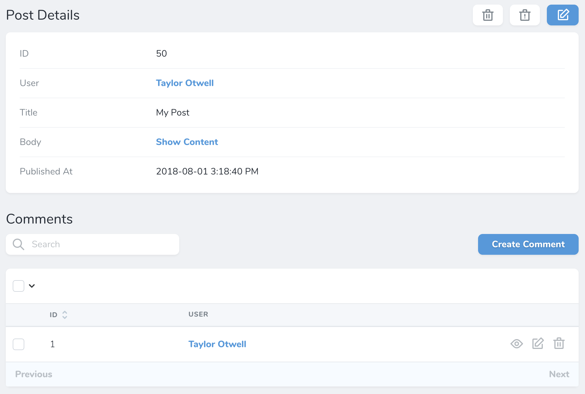
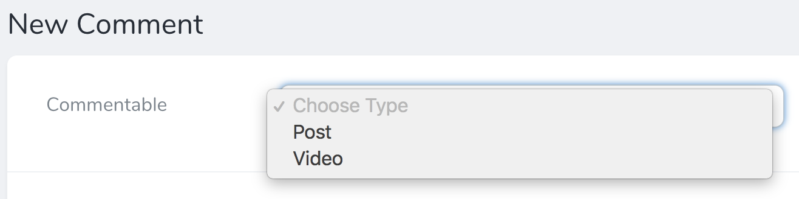
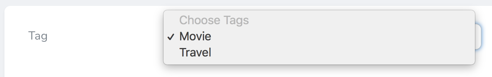
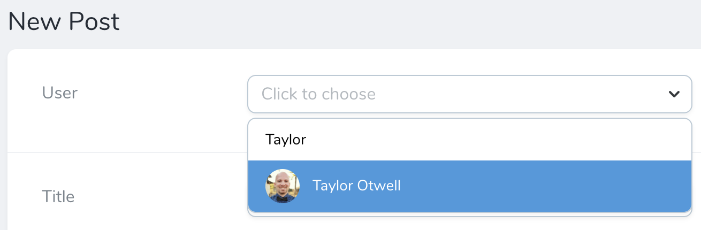

# Relationships

[[toc]]

In addition to the variety of fields we've already discussed, Nova has full support for all of Laravel's relationships. Once you add relationship fields to your Nova resources, you'll start to experience the full power of the Nova dashboard, as the resource detail screen will allow you to quickly view and search a resource's related models:



## HasOne

The `HasOne` field corresponds to a `hasOne` Eloquent relationship. For example, let's assume a `User` model `hasOne` `Address` model. We may add the relationship to our `User` Nova resource like so:

```php
use Laravel\Nova\Fields\HasOne;

HasOne::make('Address')
```

Like other types of fields, relationship fields will automatically "snake case" the displayable name of the field to determine the underlying relationship method / attribute. However, you may explicitly specify the name of the relationship method by passing it as the second argument to the field's `make` method:

```php
HasOne::make('Dirección', 'address')
```

## HasMany

The `HasMany` field corresponds to a `hasMany` Eloquent relationship. For example, let's assume a `User` model `hasMany` `Post` models. We may add the relationship to our `User` Nova resource like so:

```php
use Laravel\Nova\Fields\HasMany;

HasMany::make('Posts')
```

Once the field has been added to your resource, it will be displayed on the resource's detail screen.

:::warning Use Plural Resource Name
When defining HasMany relationship, make sure to use the plural form of the relation so Nova can infer the correct singular resource name:

```php
// Do this
HasMany::make('Posts');

// Not this
HasMany::make('Post');
```

:::

## BelongsTo

The `BelongsTo` field corresponds to a `belongsTo` Eloquent relationship. For example, let's assume a `Post` model `belongsTo` a `User` model. We may add the relationship to our `Post` Nova resource like so:

```php
use Laravel\Nova\Fields\BelongsTo;

BelongsTo::make('User')
```

:::tip Customizing Resource Classes
You can customize the resource class used by the relation field by setting the second and third parameters of the `make` method:

```php
BelongsTo::make('Author', 'author', 'App\Nova\User');
```

:::

#### Nullable Relationships

If you would like your `BelongsTo` relationship to be `nullable`, chain the `nullable` method onto the field's definition:

```php
use Laravel\Nova\Fields\BelongsTo;

BelongsTo::make('User')->nullable()
```

#### Title Attributes

When a `BelongsTo` field is shown on a resource creation / update screen, a drop-down selection menu or search menu will display the "title" of the resource. For example, a `User` resource may use the `name` attribute as its title. Then, when the resource is shown in a `BelongsTo` selection menu, that attribute will be displayed:


To customize the "title" attribute of a resource, you may define a `title` property on the resource class:

```php
public static $title = 'name';
```

Alternatively, you may override the resource's `title` method:

```php
/**
 * Get the value that should be displayed to represent the resource.
 *
 * @return string
 */
public function title()
{
    return $this->name;
}
```

## BelongsToMany

The `BelongsToMany` field corresponds to a `belongsToMany` Eloquent relationship. For example, let's assume a `User` model `belongsToMany` `Role` models. We may add the relationship to our `User` Nova resource like so:

```php
use Laravel\Nova\Fields\BelongsToMany;

BelongsToMany::make('Roles')
```

Once the field has been added to your resource, it will be displayed on the resource's detail screen.

#### Pivot Fields

If your `belongsToMany` relationship interacts with additional "pivot" fields that are stored on the intermediate table of the many-to-many relationship, you may also attach those to your `BelongsToMany` Nova relationship. Once these fields are attached to the relationship field, and the relationship has been defined on both sides, they will be displayed on the related resource index.

For example, let's assume our `User` model `belongsToMany` `Role` models. On our `role_user` intermediate table, let's imagine we have a `notes` field that contains some simple text notes about the relationship. We can attach this pivot field to the `BelongsToMany` field using the `fields` method:

```php
BelongsToMany::make('Roles')
    ->fields(function () {
        return [
            Text::make('Notes'),
        ];
    })
```

It is likely we would also define this field on the inverse of the relationship. So, if we define the `BelongsToMany` field on the `User` resource, we would define its inverse on the `Role` resource:

```php
BelongsToMany::make('Users')
    ->fields(function () {
        return [
            Text::make('Notes'),
        ];
    })
```

Since defining the field on both ends of the relationship can cause some code duplication, Nova allows you to pass an invokable object to the `fields` method:

```php
BelongsToMany::make('Users')->fields(new RoleUserFields)
```

In this example, the `RoleUserFields` class would be a simple, invokable class that returns the array of pivot fields:

```php
<?php

namespace App\Nova;

use Laravel\Nova\Fields\Text;

class RoleUserFields
{
    /**
     * Get the pivot fields for the relationship.
     *
     * @return array
     */
    public function __invoke()
    {
        return [
            Text::make('Notes'),
        ];
    }
}
```

#### Pivot Actions

Typically, [Nova actions](./../actions/defining-actions.md) operate on a resource. However, you may also attach actions to `belongsToMany` fields so that they can operate on pivot / intermediate table records. To accomplish this, you may chain the `actions` method onto your field's definition:

```php
BelongsToMany::make('Roles')
    ->actions(function () {
        return [
            new Actions\MarkAsActive,
        ];
    })
```

Once the action has been attached to the field, you will be able to select the action and execute it from the relationship index on the parent's resource detail screen.

:::tip Actions

To learn more about Nova actions, check out the complete [action documentation](./../actions/defining-actions.md).
:::

#### Title Attributes

When a `BelongsToMany` field is shown on a resource creation / update screen, a drop-down selection menu or search menu will display the "title" of the resource. For example, a `Role` resource may use the `name` attribute as its title. Then, when the resource is shown in a `BelongsToMany` selection menu, that attribute will be displayed:


To customize the "title" attribute of a resource, you may define a `title` property on the resource class:

```php
public static $title = 'name';
```

Alternatively, you may override the resource's `title` method:

```php
/**
 * Get the value that should be displayed to represent the resource.
 *
 * @return string
 */
public function title()
{
    return $this->name;
}
```

## MorphOne

The `MorphOne` field corresponds to a `morphOne` Eloquent relationship. For example, let's assume a `Post` has a one-to-one polymorphic relationship with the `Image` model. We may add the relationship to our `Post` Nova resource like so:

```php
use Laravel\Nova\Fields\MorphOne;

MorphOne::make('Image')
```

## MorphMany

The `MorphMany` field corresponds to a `morphMany` Eloquent relationship. For example, let's assume a `Post` has a one-to-many polymorphic relationship with the `Comment` model. We may add the relationship to our `Post` Nova resource like so:

```php
use Laravel\Nova\Fields\MorphMany;

MorphMany::make('Comments')
```

## MorphTo

The `MorphTo` field corresponds to a `morphTo` Eloquent relationship. For example, let's assume a `Comment` model has a polymorphic relationship with both the `Post` and `Video` models. We may add the relationship to our `Comment` Nova resource like so:

```php
use App\Nova\Post;
use App\Nova\Video;
use Laravel\Nova\Fields\MorphTo;

MorphTo::make('Commentable')->types([
    Post::class,
    Video::class,
])
```

As you can see in the example above, the `types` method is used to instruct the `MorphTo` field what types of resources it may be associated with. Nova will use this information to populate the `MorphTo` field's type selection menu on the creation and update screens:



:::tip MorphTo Title Attributes

When a `MorphTo` field is shown on a resource creation / update screen, the [title attributes](#title-attributes) of the available resources will automatically be displayed.
:::

#### Nullable Relationships

If you would like your `MorphTo` relationship to be `nullable`, chain the `nullable` method onto the field's definition:

```php
use App\Nova\Post;
use App\Nova\Video;
use Laravel\Nova\Fields\MorphTo;

MorphTo::make('Commentable')->types([
    Post::class,
    Video::class,
])->nullable()
```

## MorphToMany

The `MorphToMany` field corresponds to a `morphToMany` Eloquent relationship. For example, let's assume a `Post` has a many-to-many polymorphic relationship with the `Tag` model. We may add the relationship to our `Post` Nova resource like so:

```php
use Laravel\Nova\Fields\MorphToMany;

MorphToMany::make('Tags')
```

#### Pivot Fields

If your `morphToMany` relationship interacts with additional "pivot" fields that are stored on the intermediate table of the many-to-many relationship, you may also attach those to your `MorphToMany` Nova relationship. Once these fields are attached to the relationship field, they will be displayed on the related resource index.

For example, on our `taggables` intermediate table, let's imagine we have a `notes` field that contains some simple text notes about the relationship. We can attach this pivot field to the `MorphToMany` field using the `fields` method:

```php
MorphToMany::make('Tags')
    ->fields(function () {
        return [
            Text::make('Notes'),
        ];
    })
```

It is likely we would also define this field on the inverse of the relationship. So, if we define the `MorphToMany` field on the `Post` resource, we would define it's inverse on the `Tag` resource:

```php
MorphToMany::make('Posts')
    ->fields(function () {
        return [
            Text::make('Notes'),
        ];
    })
```

Since defining the field on both ends of the relationship can cause some code duplication, Nova allows you to pass an invokable object to the `fields` method:

```php
MorphToMany::make('Users')->fields(new TaggableFields)
```

In this example, the `TaggableFields` class would be a simple, invokable class that returns the array of pivot fields:

```php
<?php

namespace App\Nova;

use Laravel\Nova\Fields\Text;

class TaggableFields
{
    /**
     * Get the pivot fields for the relationship.
     *
     * @return array
     */
    public function __invoke()
    {
        return [
            Text::make('Notes'),
        ];
    }
}
```

#### Title Attributes

When a `MorphToMany` field is shown on a resource creation / update screen, a drop-down selection menu or search menu will display the "title" of the resource. For example, a `Tag` resource may use the `name` attribute as its title. Then, when the resource is shown in a `MorphToMany` selection menu, that attribute will be displayed:



To customize the "title" attribute of a resource, you may define a `title` property on the resource class:

```php
public static $title = 'name';
```

Alternatively, you may override the resource's `title` method:

```php
/**
 * Get the value that should be displayed to represent the resource.
 *
 * @return string
 */
public function title()
{
    return $this->name;
}
```

## Searchable Relations

By default, when the `BelongsTo`, `MorphTo`, and `MorphToMany` relationship fields are shown on a resource creation / update screen, a simple drop-down selection menu will be displayed. However, this can quickly become cumbersome if a resource model has many records. For example, imagine a drop-down selection menu populated with over 10,000 users!

Instead of displaying a drop-down selection menu, you may mark your relationships as `searchable`. When a relationship is marked as `searchable`, a beautiful search input control will be displayed instead:



To mark as relationship as `searchable`, chain the `searchable` method onto the field's definition:

```php
BelongsTo::make('User')->searchable()
```
